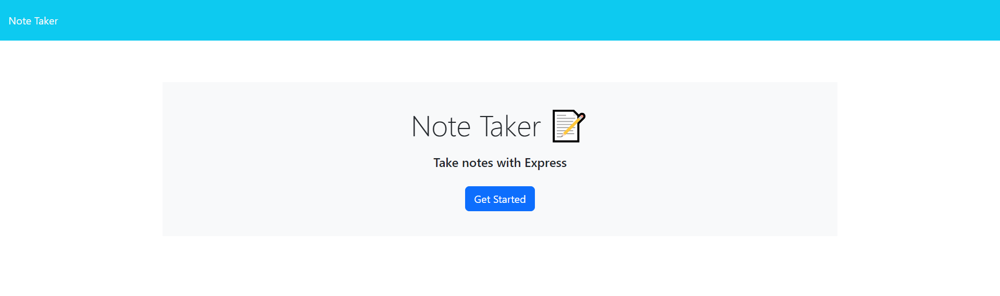

# Note-Taker

## Table of Contents
[Description](#Description)

[Installation](#Installation)

[Usage](#Usage)

[Contributing](#Contributing)

[Tests](#Tests)

[Questions](#Questions)

## Description 
This project servers as an application for note taking. The user will be able to enter and delete notes that are stored in a JSON file so that when they come back to the website later thier notes will still be there.
## Installation 
If running from the command line the user will first need to clone the the repository code onto their own machine. From there they will need to install all the dependencies included in the package.json file by running the "npm -i" in the commands line. From there they can run the index.js file in the terminal to run the program by calling the command "node index.js" this will start the server side from there they can go to the locally hosted website to use the application. If accessing hosted website no installation is needed.
## Usage 
To use the application the user can click on the get started button on the homepage to be taken to the note taking page. from there they can see thier notes on the left and a place to enter new notes on the right. They can hit the plug button in the nav bar to add a new note. Once all the info has been added to the note they can hit the save icon to save the note and it will be populated on the left. If the they want to delete the note they can hit the garbage can on the note to remove it from the list.
 

 

Link to deployed website:  https://ian-danas-note-taker.herokuapp.com
## Contributing 
Ian Danas
## Tests 
N/A

## Questions 
if you have an additional questions about the project reach out to me at the github username or the email below

 github: https://github.com/Ian-Danas

 Email: ianmdanas@gmail.com

